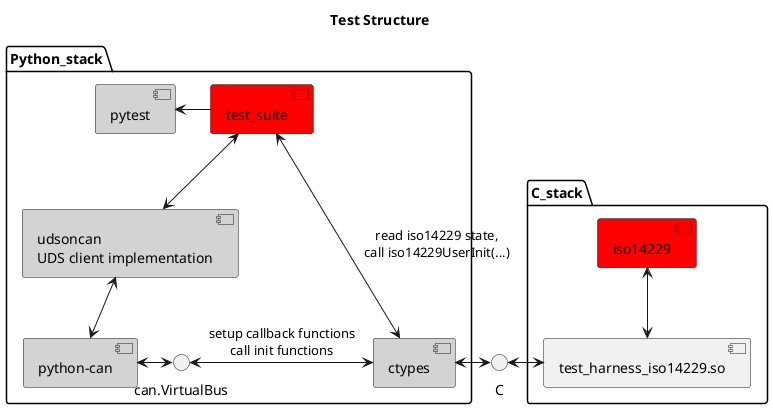

## Testing

## Note

`ASSUMPTION` marks where a simplifying assumption was made about the use of this library 

## TODO
- hook calls to `time.time()` in `python-isotp` and `udsoncan` to eliminate host computer latency effects